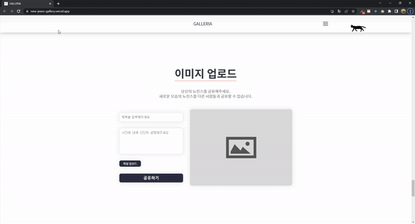

> 디자인 원본 출처: [강희](https://github.com/kheeyaa)님

# 개요

뉴진스 갤러리아는 개발자 블로그에서 영감을 받아 제작한 프로젝트입니다.

기존의 디자인과 기능을 참고하면서 TypeScript와 React-recoil같은 최신 기술들을 직접 적용해보며
학습한 프로젝트입니다.

특히 전역 상태 관리가 필요한 부분을 간단하고 효율적으로 처리하기 위해 React-recoil을 사용했습니다.

# 주요 기능 및 기여
 

## 애니메이션 및 전체 구현화면

 

- react-awesome-reveal 라이브러리를 사용해 애니메이션 효과를 추가하여 UX를 개선했습니다.
- 시맨틱한 HTML 태그를 적극 활용하여 SEO와 접근성을 개선했습니다.

 

- 로컬 스토리지를 활용한 게시글 작성 기능을 구현했습니다.

 

# 끝으로..

- 이번 프로젝트를 통해 처음으로 TypeScript와 React를 결합하여 작업하면서
타입 적용의 유연함과 안정성을 직접 체감할 수 있었습니다.

- 특히, 부모 컴포넌트에서 자식 컴포넌트로 props를 전달할 때 발생한 작은 실수들조차 TypeScript가 엄격하게 잡아내는 모습을 보며 그 정교함에 깊은 인상을 받았습니다.

- 또한, 스프라이트 이미지를 활용해 스크롤할 때마다 고양이가 움직이는 재미있는 효과를 구현하면서
이미지 최적화와 활용법에 대해 더 깊이 이해하게 되었습니다.

- 마지막으로, 뛰어난 개발자의 HTML과 CSS 구조를 분석하며 그들의 작업 방식을 배우고, 이를 제 코드에 녹여내면서 실력을 한 단계 성장시킬 수 있었습니다.

